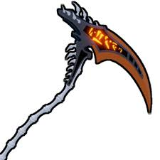
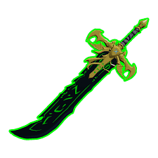
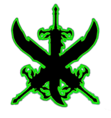
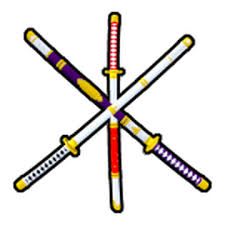
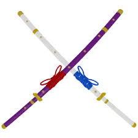

<html>
<head>
    <title>Mythical Blox Fruit Swords</title>

    <!-- Linking the external CSS file for styles -->
    <link rel="stylesheet" href="main.css">
</head>

<body>
    

        <!-- Welcome banner at the top of the page -->
        

            <h2>Welcome to the Ultimate Blox Fruit Mythical Sword Guide!</h2>
            
Master the mightiest blades in the game with our complete sword breakdown.

        <!-- Navigation menu container -->
        <nav class="menu">
        <!-- Unordered list to hold menu items -->
        <ul>
        <!-- Menu item linking to Home page -->
        <li><a href="index.html">Home</a></li>
        <!-- Menu item linking to Hallow Scythe page -->
        <li><a href="hallowscytheforwebsite.html">Hallow Scythe</a></li>
        <!-- Menu item linking to Dark Blade page -->
        <li><a href="dbforwebsite.html">Dark Blade</a></li>
        <!-- Menu item linking to True Triple Yoru page -->
        <li><a href="ttyforwebsite.html">True Triple Yoru</a></li>
        <!-- Menu item linking to True Triple Katana page -->
        <li><a href="ttkforwebsite.html">True Triple Katana</a></li>
        <!-- Menu item linking to Cursed Dual Katana page -->
        <li><a href="cdkforwebsite.html">Cursed Dual Katana</a></li>
        </ul>
        </nav>
        

        
        <!-- Page header with subtitle/introduction text -->

        <header>
            

                Explore the ultimate guide to all Mythical swords in Blox Fruits—legendary blades,
                powerful abilities, and unique skills await. Discover their origins, strengths, and
                how to wield them like a true warrior!
            

        </header>

        <main>
            <!-- Description section explaining what Mythical swords are -->
            <section class="description">
                

                    The five Mythical Swords in Blox Fruits are melee weapons designed for
                    close-quarters combat. These swords emphasize precision and devastating
                    short-range attacks. Each sword comes with two distinct abilities, often
                    influenced by their Blox Fruit counterpart or other mystical sources.
                

            </section>

            <!-- Gallery section with images that link to each individual sword's page -->
            <section class="sword-gallery">
                <!-- Hallow Scythe image and page link -->
                

                <!-- Dark Blade image and page link -->
                

                <!-- True Triple Yoru image and page link -->
                

                <!-- True Triple Katana image and page link -->
                

                <!-- Cursed Dual Katana image and page link -->
                
            </section>

            <!-- Bottom buttons for additional navigation -->
            <section class="bottom-buttons">
                <!-- Link to Contact Us page -->
                <a href="contactus.html" class="btn">📬 Contact Us</a>
                <!-- Link to Feedback page -->
                <a href="feedback.html" class="btn">📝 Feedback</a>
            </section>
        </main>
    

</body>
</html>
